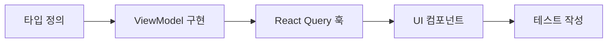

<p align="center">
  
</p>

# 단지톡 (DanjiTalk) - 아파트 커뮤니티 플랫폼


## ✔️ 소개
단지톡은 아파트 주민들을 위한 종합 커뮤니티 플랫폼입니다. 단지 정보 조회, 커뮤니티 소통, 채팅, 시설 정보 등 아파트 생활에 필요한 모든 기능을 제공합니다.

<br/>
<br/>

## ✔️ 주요 기능

| 카테고리 | 세부 기능 | 설명 |
|:-------:|----------|------|
| **홈** | 메인 대시보드 | • 단지 검색<br>• 메뉴 그리드 (단지정보, 커뮤니티, 공지사항 등)<br>• 빠른 접근 기능 |
| **검색** | 단지 검색 | • 실시간 자동완성<br>• 추천 검색어, 인기 검색어<br>• 최근 찾아본 단지<br>• 검색 결과 필터링 및 즐겨찾기 |
| **단지 정보** | 단지 상세 정보 | • 단지 기본 정보 (세대수, 동수, 주소 등)<br>• 단지 등록 및 관리<br>• 단지별 커뮤니티 |
| **커뮤니티** | 게시판 | • 게시글 목록/상세/작성<br>• 댓글/대댓글 시스템<br>• 좋아요, 북마크, 조회수<br>• 이미지 업로드 |
| **채팅** | 실시간 채팅 | • 1:1 채팅<br>• 단체 채팅<br>• 채팅 요청 관리<br>• 읽지 않은 메시지 알림 |
| **시설 정보** | 단지 시설 | • 공용 시설 정보<br>• 시설 예약<br>• 이용 안내 |
| **공지사항** | 관리사무소 공지 | • 공지사항 목록/상세<br>• 중요도별 분류<br>• 알림 설정 |
| **방문차량** | 방문차량 등록 | • 방문차량 등록/관리<br>• 등록 내역 조회 |
| **회원 관리** | 계정 관리 | • 회원가입/로그인 (이메일, 소셜)<br>• 프로필 관리<br>• 계정 찾기/탈퇴 |
| **마이페이지** | 개인 정보 | • 내 게시글/댓글<br>• 즐겨찾기/스크랩<br>• 채팅 내역<br>• 차량 등록 내역 |
| **즐겨찾기** | 즐겨찾기 관리 | • 단지 즐겨찾기<br>• 게시글 즐겨찾기<br>• 카테고리별 정리 |

<br/>
<br/>

## ✔️ 기술 스택

| 카테고리 | 기술 | 버전 | 설명 |
|:-------:|------|:----:|------|
| **프레임워크** | React | 18.3.1 | UI 라이브러리 |
| | TypeScript | 5.6.2 | 정적 타입 검사 |
| | Vite | 6.0.5 | 빌드 도구 및 개발 서버 |
| **상태 관리** | React Query | 5.64.1 | 서버 상태 관리 (API 요청, 캐싱) |
| | Zustand | 5.0.3 | 클라이언트 상태 관리 |
| **라우팅** | React Router | 7.1.2 | 클라이언트 사이드 라우팅 |
| **스타일링** | SCSS Modules | 1.83.4 | CSS 전처리기 및 모듈화 |
| | CSS Variables | - | 테마 시스템 |
| **API 통신** | Axios | 1.8.2 | HTTP 클라이언트 |
| **실시간 통신** | STOMP.js | 7.1.1 | WebSocket 클라이언트 |
| | SockJS | 1.6.1 | WebSocket 폴백 |
| **UI/UX** | Storybook | 8.5.0 | 컴포넌트 개발 환경 |
| | Chromatic | 3.2.3 | 시각적 테스트 |
| **코드 품질** | ESLint | 9.21.0 | 코드 린팅 |
| | Prettier | 3.5.3 | 코드 포맷팅 |
| **개발 도구** | JSON Server | 1.0.0-beta.3 | 목 API 서버 |

<br/>
<br/>

## ✔️ 시작하기

### 개발 환경 설정
```bash
# 저장소 클론
git clone https://github.com/DanjiTalk/danji-talk-frontend.git
cd danji-talk-frontend

# 패키지 설치
npm install

# 개발 서버 실행
npm run dev

# 목 API 서버 실행
npm run server

# Storybook 실행
npm run storybook

# 빌드
npm run build

# 린트 검사
npm run lint

# 코드 포맷팅
npm run format
```

### 브라우저 지원

| 브라우저 | 지원 버전 |
|:-------:|:--------:|
| Chrome | 90+ |
| Firefox | 88+ |
| Safari | 14+ |
| Edge | 90+ |

<br/>
<br/>

## ✔️ 아키텍처 및 프로젝트 구조

### 아키텍처 패턴

| 패턴 | 설명 | 이점 |
|:-----:|------|-----|
| **ViewModel 패턴** | 비즈니스 로직과 UI 로직 분리 | • 관심사 분리<br>• 테스트 용이성<br>• 재사용성 향상 |
| **Feature-based Architecture** | 기능별 모듈화 | • 독립적 개발/배포<br>• 코드 탐색 용이<br>• 유지보수성 향상 |
| **BEM CSS 방법론** | CSS 클래스 명명 규칙 | • 스타일 충돌 방지<br>• 일관된 네이밍<br>• 유지보수성 향상 |

<br/>

### 데이터 흐름

```
API Server → ViewModel → React Query Hook → Component → UI
```

| 단계 | 담당 | 역할 |
|:-----:|:------:|-----|
| 1 | **API Server** | 백엔드 API 제공 |
| 2 | **ViewModel** | 비즈니스 로직 처리 |
| 3 | **React Query Hook** | 상태 관리 및 캐싱 |
| 4 | **Component** | UI 렌더링 |
| 5 | **UI** | 사용자 인터페이스 |

<br/>

### 프로젝트 구조

```bash
src/
├── api/                          # API 통신 인프라
│   ├── client.ts                 # Axios 기반 HTTP 클라이언트
│   ├── endpoints.ts              # API 엔드포인트 정의
│   ├── types.ts                  # API 공통 타입
│   └── index.ts                  # API 모듈 진입점
│
├── features/                     # 기능별 모듈
│   ├── auth/                     # 인증 기능
│   │   ├── models/               # ViewModel
│   │   ├── hooks/                # React Query 훅
│   │   ├── types.ts              # 타입 정의
│   │   └── index.ts              # 모듈 내보내기
│   ├── board/                    # 게시판 기능
│   ├── comment/                  # 댓글 기능
│   ├── search/                   # 검색 기능
│   └── user/                     # 사용자 기능
│
├── components/                   # 공통 UI 컴포넌트
│   ├── common/                   # 기본 컴포넌트
│   │   ├── Button/               # 버튼 컴포넌트
│   │   ├── InputField/           # 입력 필드
│   │   ├── Modal/                # 모달
│   │   └── Spinner/              # 로딩 스피너
│   ├── Search/                   # 검색 관련 컴포넌트
│   │   ├── SearchBar.tsx         # 검색바
│   │   └── HomeSearchBar.tsx     # 홈용 검색바
│   ├── MenuGrid/                 # 메뉴 그리드
│   └── Landing/                  # 랜딩 페이지 컴포넌트
│
├── pages/                        # 페이지 컴포넌트
│   ├── Home/                     # 홈 페이지
│   ├── Search/                   # 검색 페이지
│   ├── Board/                    # 게시판 페이지
│   ├── Chat/                     # 채팅 페이지
│   ├── Login/                    # 로그인 페이지
│   └── ...                       # 기타 페이지
│
├── layouts/                      # 레이아웃 컴포넌트
│   ├── Header.tsx                # 헤더
│   └── Footer.tsx                # 푸터
│
├── routes/                       # 라우팅 설정
│   ├── AppRoutes.tsx             # 메인 라우트
│   ├── MainRoutes.tsx            # 메인 페이지 라우트
│   ├── AuthRoutes.tsx            # 인증 라우트
│   └── ProtectedRoute.tsx        # 보호된 라우트
│
├── stores/                       # 전역 상태 (Zustand)
│   ├── authStore.ts              # 인증 상태
│   ├── alertStore.ts             # 알림 상태
│   └── themeStore.ts             # 테마 상태
│
├── hooks/                        # 커스텀 훅
│   ├── useAuth.ts                # 인증 훅
│   ├── useMediaQuery.ts          # 미디어 쿼리 훅
│   └── ...                       # 기타 훅
│
├── styles/                       # 전역 스타일
│   ├── global.scss               # 전역 스타일
│   ├── variables.scss            # CSS 변수
│   └── mixins.scss               # SCSS 믹스인
│
├── types/                        # 전역 타입 정의
│   ├── auth.ts                   # 인증 타입
│   ├── board.ts                  # 게시판 타입
│   └── search.ts                 # 검색 타입
│
├── utils/                        # 유틸리티 함수
│   ├── formatDate.ts             # 날짜 포맷팅
│   └── calculateSum.ts           # 계산 유틸
│
├── mocks/                        # 목 데이터
│   └── db.json                   # JSON Server 데이터
│
├── assets/                       # 정적 자산
│   ├── logo.svg                  # 로고
│   ├── icons/                    # 아이콘들
│   └── images/                   # 이미지들
│
├── App.tsx                       # 앱 루트 컴포넌트
└── main.tsx                      # 진입점
```

<br/>
<br/>

## ✔️ 주요 기능 상세

### 🔍 검색 시스템
- **실시간 자동완성**: 입력 중 실시간 검색어 제안
- **키보드 네비게이션**: 위아래키로 검색 결과 탐색
- **검색 결과 필터링**: 단지명, 지역별 필터링
- **즐겨찾기 기능**: 검색 결과 즐겨찾기 추가/제거
- **검색 히스토리**: 최근 검색어 및 찾아본 단지 관리

### 💬 채팅 시스템
- **실시간 채팅**: WebSocket 기반 실시간 메시지 전송
- **1:1 채팅**: 개인 간 대화
- **단체 채팅**: 단지별 공용 채팅방
- **채팅 요청**: 새로운 채팅 요청 관리
- **읽지 않은 메시지**: 알림 배지 및 읽음 처리

### 📝 커뮤니티
- **게시글 관리**: CRUD 기능
- **댓글 시스템**: 계층형 댓글 (대댓글)
- **반응 기능**: 좋아요, 북마크, 조회수
- **이미지 업로드**: 다중 이미지 첨부
- **카테고리 분류**: 게시글 카테고리별 분류

### 🏢 단지 정보
- **단지 등록**: 새로운 단지 정보 등록
- **상세 정보**: 세대수, 동수, 주소 등
- **시설 정보**: 공용 시설 및 이용 안내
- **관리사무소 연락처**: 단지별 관리사무소 정보

<br/>
<br/>

## ✔️ 개발 가이드

### 새 기능 개발 흐름



| 순서 | 작업 | 설명 |
|:-----:|:------:|-----|
| 1️⃣ | **타입 정의** | `types.ts`에 인터페이스 정의 |
| 2️⃣ | **ViewModel 구현** | `models/`에 비즈니스 로직 구현 |
| 3️⃣ | **React Query 훅** | `hooks/`에 상태 관리 훅 구현 |
| 4️⃣ | **UI 컴포넌트** | 컴포넌트 및 페이지 구현 |
| 5️⃣ | **테스트 작성** | 단위/통합 테스트 작성 |

<br/>

### 코드 컨벤션

| 항목 | 규칙 | 예시 |
|:-----:|------|------|
| **컴포넌트명** | PascalCase | `SearchBar`, `HomePage` |
| **함수/변수** | camelCase | `handleSearch`, `searchInput` |
| **상수** | UPPER_SNAKE_CASE | `API_BASE_URL` |
| **파일명** | kebab-case | `search-bar.tsx`, `home-page.tsx` |
| **CSS 클래스** | BEM 방식 | `search-bar__input`, `search-bar__button--active` |
| **커밋 메시지** | Conventional Commits | `feat: add search functionality` |

<br/>

### ViewModel 규칙

| 규칙 | 설명 |
|:-----:|------|
| **순수 함수** | 부수 효과 없이 순수한 비즈니스 로직만 포함 |
| **에러 처리** | 명확한 에러 메시지와 함께 에러 throw |
| **타입 안전성** | TypeScript strict 모드 준수 |
| **단일 책임** | 하나의 도메인에 대한 책임만 가짐 |

<br/>

### React Query 훅 규칙

| 규칙 | 설명 |
|:-----:|------|
| **queryKey 구조화** | `['domain', 'action', params]` 형태로 구성 |
| **캐시 전략** | 적절한 staleTime, cacheTime 설정 |
| **낙관적 업데이트** | 사용자 경험 향상을 위한 즉시 UI 업데이트 |
| **에러 처리** | 사용자 친화적 에러 메시지 제공 |

<br/>
<br/>

## ✔️ 테스트

### 테스트 환경
- **Jest**: 테스트 러너
- **React Testing Library**: 컴포넌트 테스트
- **Storybook**: 컴포넌트 개발 및 시각적 테스트
- **Chromatic**: 시각적 회귀 테스트

### 테스트 실행
```bash
# 단위 테스트
npm test

# Storybook 테스트
npm run storybook

# 시각적 테스트
npm run chromatic
```

<br/>
<br/>

## ✔️ 배포

### 배포 환경
- **Vercel**: 프론트엔드 배포
- **GitHub Actions**: CI/CD 파이프라인
- **Chromatic**: 시각적 테스트 자동화

### 배포 프로세스
1. **개발**: feature 브랜치에서 개발
2. **테스트**: PR 시 자동 테스트 실행
3. **리뷰**: 코드 리뷰 후 main 브랜치 병합
4. **배포**: 자동으로 Vercel에 배포

<br/>
<br/>

## ✔️ 보안

### 보안 정책
- **의존성 스캔**: Dependabot을 통한 자동 취약점 감지
- **환경 변수**: 민감한 정보는 환경 변수로 관리
- **HTTPS**: 모든 통신은 HTTPS로 암호화
- **CORS**: 적절한 CORS 정책 설정

<br/>
<br/>

## ✔️ 기여하기

### 기여 프로세스
1. **Fork**: 저장소를 포크
2. **브랜치**: feature 브랜치 생성
3. **개발**: 기능 개발 및 테스트
4. **PR**: Pull Request 생성
5. **리뷰**: 코드 리뷰 후 병합

### 브랜치 전략
- `main`: 프로덕션 브랜치
- `develop`: 개발 브랜치
- `feature/*`: 기능 개발
- `hotfix/*`: 긴급 수정

<br/>
<br/>

## ✔️ 라이선스

이 프로젝트는 MIT 라이선스 하에 배포됩니다. 자세한 내용은 [LICENSE](LICENSE) 파일을 참조하세요.

<br/>
<br/>

## ✔️ 연락처

- **프로젝트**: GitHub Repository
- **이슈**: GitHub Issues
- **문의**: 프로젝트 이슈를 통해 문의해주세요.

---

<p align="center">
  <strong>단지톡으로 더 나은 아파트 생활을 만들어가세요! 🏢💬</strong>
</p>
